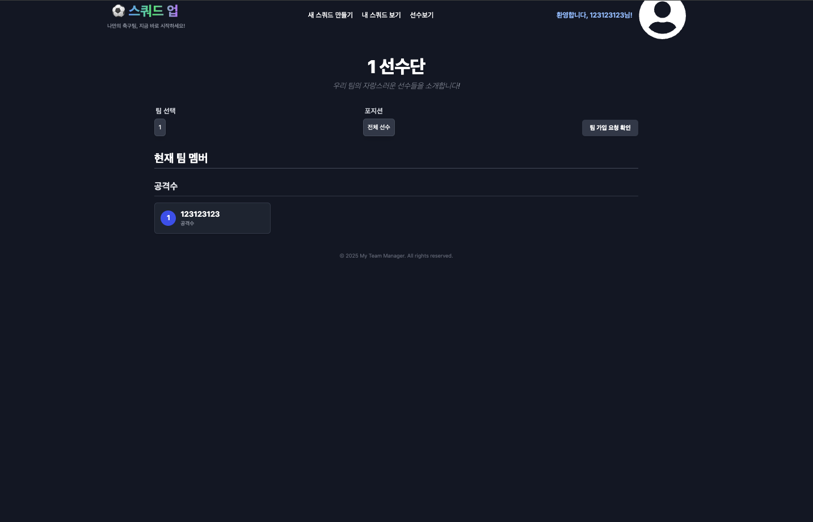
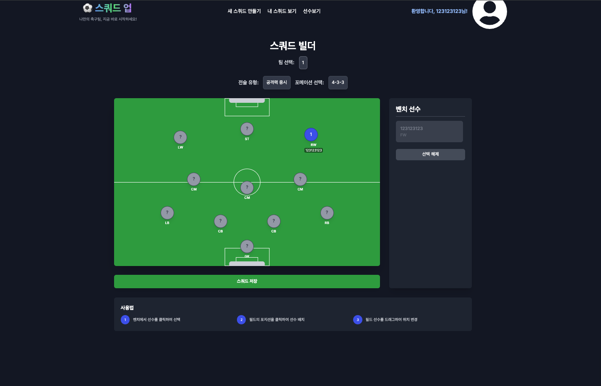
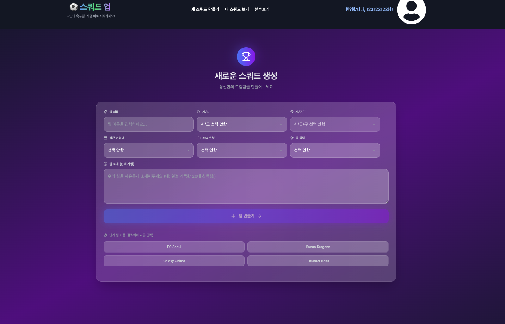

# ⚽ Squad Up

**축구 동호인들을 위한 멤버 관리와 스쿼드 포지션 배치를 돕는 웹 애플리케이션**

---

## 📌 프로젝트 소개

**Squad Up**은 축구 동호회, 소모임, 아마추어 팀을 위해 만들어진 **팀 관리 웹 애플리케이션**입니다.
경기마다 반복되는 멤버 정리와 포지션 배치의 번거로움을 줄이고, 보다 효율적으로 스쿼드를 구성할 수 있도록 돕는 것을 목표로 합니다.

---

## 🎯 주요 기능

* 👥 **팀 멤버 관리**

  * 팀원 등록 / 수정 / 삭제
  * 포지션 및 개인 정보 관리

* 📋 **스쿼드 구성**

  * 경기별 출전 멤버 선택
  * 포지션 기반 스쿼드 배치

* ⚽ **포지션 배치 지원**

  * 축구 포지션을 고려한 직관적인 배치
  * 실전 경기 중심의 구성 방식

---

## 🧩 기획 의도

축구 동호회 운영 시 발생하는

* 매 경기마다 반복되는 라인업 논의
* 종이 또는 메신저로 관리되는 비효율적인 명단 정리

와 같은 불편함을 해결하고자 **Squad Up**을 기획했습니다.
누구나 쉽게 사용할 수 있는 UI와 실제 경기 상황에 맞춘 기능 제공을 핵심 가치로 두고 있습니다.

---

## 🛠️ 사용 기술 (Tech Stack)

프로젝트에 사용된 주요 기술 스택입니다.

### **Frontend**

  *  - 컴포넌트 기반 UI 개발 및 상태 관리
  *  - 안정적인 코드 작성 및 타입 추론
  *  - 유연하고 빠른 스타일링 및 반응형 디자인
  *  - 효율적인 전역 상태 관리 (멤버 및 스쿼드 데이터)

### **Backend & Storage**

  *  - 서버 사이드 런타임 환경
  *  - 실시간 데이터베이스 및 사용자 인증(Auth)

### **Deployment**

  *  - 빠르고 간편한 프론트엔드 배포

---

## 🚀 향후 확장 아이디어

* 경기 기록 및 출석 관리
* 포지션 선호도 기반 자동 추천
* 모바일 환경 최적화
* 팀별 통계 및 히스토리 제공

---

## 🖥️ 화면 미리보기

> Squad Up의 주요 기능 화면 (메인 / 선수 리스트 / 스쿼드 배치 / 팀 생성)

<table>
  <tr>
    <td align="center">
      <strong>메인 화면</strong> 
      
    </td>
    <td align="center">
      <strong>선수 리스트</strong> 
      
    </td>
  </tr>
  <tr>
    <td align="center">
      <strong>스쿼드 배치</strong> 
      
    </td>
    <td align="center">
      <strong>팀 생성</strong> 
      
    </td>
  </tr>
</table>

---

## 📁 이미지 폴더 구조
